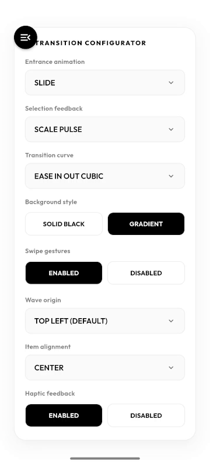

# Fluid Side Menu

[](https://pub.dev/packages/fluid_side_menu)
[](https://pub.dev/packages/fluid_side_menu/likers)
[](https://flutter.dev)
[](https://opensource.org/licenses/BSD-3-Clause)

A premium, highly-customizable fluid side navigation drawer for Flutter. Features an organic, gooey liquid-reveal transition using high-performance custom vector splines, staggered entrance animations, nested dropdown navigation, tactile haptic feedback, edge swipe gestures, and rich selection feedback behaviors.



---

## Table of Contents

- [Why Fluid Side Menu?](#why-fluid-side-menu)
- [Features](#features)
- [Getting started](#getting-started)
- [Usage](#usage)
  - [Standard Setup](#standard-setup)
  - [Nested Dropdown Items](#nested-dropdown-items)
  - [Per-Item Sizing](#per-item-sizing)
  - [Programmatic Control](#programmatic-control)
  - [Customizing the Reveal Background](#customizing-the-reveal-background)
  - [Scrollable Menu](#scrollable-menu)
- [API Reference](#api-reference)
  - [FluidSideMenu Options](#fluidsidemenu-options)
  - [FluidMenuItem Options](#fluidmenuitem-options)
  - [Selection Feedback Animations](#selection-feedback-animations)
  - [Item Alignment](#item-alignment)
- [Additional information](#additional-information)
  - [Source Code and Contributions](#source-code-and-contributions)
  - [Reporting Issues](#reporting-issues)
  - [License](#license)

---

## Why Fluid Side Menu?

While standard side drawers transition rigidly across the screen, Fluid Side Menu uses organic motion curves and wavy vector splines to deliver a fluid, high-fidelity navigational experience.

Key benefits include:

- **No Edge Pixelation:** Custom waves are drawn dynamically as sharp vector paths, avoiding the pixelation or fuzzy edges common with raster masks.
- **Optimized Performance:** Leverages isolated `RepaintBoundary` nodes and linear animation inputs to run smoothly at 60fps / 120fps even on lower-end devices.
- **Nested Navigation:** Supports arbitrarily deep dropdown item trees with smooth animated expand/collapse transitions.
- **Custom Easing Curves:** The fluid wave transition supports custom animation curves (springy elastic waves, snappy deceleration, or bounce reveals).
- **Scroll-Safe:** The menu item list automatically scrolls when content overflows the screen — even with many expanded nested items.

---

## Features

- **Organic Liquid Transition:** High-performance transition using custom vector wave splines that merge and expand across the screen.
- **Nested Dropdown Navigation:** Items can declare child items (`subItems`) to create collapsible, animated dropdown groups of arbitrary depth.
- **Per-Item Sizing:** Override text style and icon size on individual `FluidMenuItem` instances independent of global defaults.
- **Scrollable Item List:** When the total item list overflows the screen, the menu scrolls automatically. Fully configurable via `ScrollPhysics` and `ScrollController`.
- **Staggered Option Animations:** Smooth, delayed entrance animations for menu items (fade, scale, or springy slide-up).
- **Rich Selection Feedback:** A collection of interactive tap animations including the Icon Slide Swap effect.
- **Tactile Haptic Feedback:** Haptics on open, close, and item selection with de-duplicated triggers.
- **Edge Swipe Gestures:** Pull-to-open from the left edge, swipe-to-close when the drawer is open.
- **Item Alignment:** Align all menu items to the left, center, or right of the drawer.
- **Item-Level Customization:** Override colors, text styles, spacings, and individual item sizes independently.
- **Programmatic Control:** `open()`, `close()`, `toggle()` via `FluidSideMenu.of(context)` or a `GlobalKey`.

---

## Getting started

Add `fluid_side_menu` to your `pubspec.yaml` dependencies:

```yaml
dependencies:
  fluid_side_menu: ^1.3.0
```

Then import the package in your Dart code:

```dart
import 'package:fluid_side_menu/fluid_side_menu.dart';
```

---

## Usage

### Standard Setup

```dart
import 'package:flutter/material.dart';
import 'package:fluid_side_menu/fluid_side_menu.dart';

void main() => runApp(const MyApp());

class MyApp extends StatelessWidget {
  const MyApp({super.key});

  @override
  Widget build(BuildContext context) {
    return MaterialApp(
      title: 'Fluid Side Menu Demo',
      theme: ThemeData(useMaterial3: true),
      home: const DemoScreen(),
    );
  }
}

class DemoScreen extends StatefulWidget {
  const DemoScreen({super.key});

  @override
  State<DemoScreen> createState() => _DemoScreenState();
}

class _DemoScreenState extends State<DemoScreen> {
  @override
  Widget build(BuildContext context) {
    final List<FluidMenuItem> items = [
      FluidMenuItem(
        label: 'Home',
        page: const HomeScreen(),
        icon: const Icon(Icons.home),
      ),
      FluidMenuItem(
        label: 'About',
        page: const AboutScreen(),
        icon: const Icon(Icons.info),
      ),
      FluidMenuItem(
        label: 'Contact',
        page: const ContactScreen(),
        icon: const Icon(Icons.mail),
        // Item-level color overrides
        textColor: Colors.orangeAccent,
        iconColor: Colors.orangeAccent,
      ),
    ];

    return Scaffold(
      body: FluidSideMenu(
        fluidColor: Colors.black,
        duration: const Duration(milliseconds: 700),
        showBuiltInButtons: true,
        menuAnimationType: FluidMenuAnimationType.slide,
        selectAnimationType: FluidMenuSelectAnimationType.iconSlideSwap,
        menuItems: items,
      ),
    );
  }
}
```

---

### Nested Dropdown Items

Give any `FluidMenuItem` a `subItems` list to turn it into a collapsible dropdown group. Child items can themselves have `subItems` for arbitrary nesting depth. Parent items that only act as group headers do not need a `page`.

```dart
FluidMenuItem(
  label: 'Categories',
  icon: const Icon(Icons.category),
  // No page — this item is a dropdown header only
  subItems: [
    FluidMenuItem(
      label: 'Baskets',
      icon: const Icon(Icons.shopping_basket),
      subItems: [
        FluidMenuItem(
          label: 'Woven Baskets',
          page: const BasketsScreen(),
          icon: const Icon(Icons.shopping_bag),
        ),
        FluidMenuItem(
          label: 'Plastic Baskets',
          page: const BasketsScreen(),
          icon: const Icon(Icons.shopping_basket),
        ),
      ],
    ),
    FluidMenuItem(
      label: 'Gifts',
      page: const GiftsScreen(),
      icon: const Icon(Icons.card_giftcard),
    ),
  ],
),
```

Control the text and icon size for all child items via widget-level parameters:

```dart
FluidSideMenu(
  menuItems: items,
  subMenuItemTextStyle: TextStyle(fontSize: 20, fontWeight: FontWeight.w500),
  subMenuItemIconSize: 18.0,
  // ... other parameters
)
```

---

### Per-Item Sizing

Individual items can declare their own `textStyle` and `iconSize`, which take the highest priority — overriding the widget-level `subMenuItemTextStyle`/`subMenuItemIconSize` and the automatic depth-scaling factor.

```dart
FluidMenuItem(
  label: 'Featured Item',
  page: const FeaturedScreen(),
  icon: const Icon(Icons.star),
  textStyle: TextStyle(
    fontSize: 18,
    fontWeight: FontWeight.w700,
    letterSpacing: 0.3,
  ),
  iconSize: 22.0,
),
```

To disable automatic depth-based scaling entirely and rely only on explicit sizes, set `scaleChildItemsBasedOnDepth: false` on the `FluidSideMenu` widget.

---

### Programmatic Control

Open, close, or toggle the drawer from any descendant widget using the static accessor:

```dart
// Open the side menu
FluidSideMenu.of(context)?.open();

// Close the side menu
FluidSideMenu.of(context)?.close();

// Toggle the side menu
FluidSideMenu.of(context)?.toggle();
```

Alternatively assign a `GlobalKey<FluidSideMenuState>` and call `key.currentState?.open()`.

---

### Customizing the Reveal Background

Pass a `LinearGradient` or `RadialGradient` to create a rich gradient appearance for the gooey wave:

```dart
FluidSideMenu(
  menuItems: items,
  fluidGradient: const LinearGradient(
    colors: [
      Color(0xFF0F0C20), // Dark indigo-black
      Color(0xFF15102A), // Dark violet
      Color(0xFF06040A), // Deep black
    ],
    begin: Alignment.topLeft,
    end: Alignment.bottomRight,
  ),
)
```

---

### Scrollable Menu

By default (`enableScroll: true`) the menu item list is wrapped in a `SingleChildScrollView`, allowing users to scroll down to reach items that overflow the screen height — especially useful when many dropdown groups are expanded simultaneously.

```dart
FluidSideMenu(
  menuItems: items,
  enableScroll: true,               // default — can omit
  scrollPhysics: const BouncingScrollPhysics(), // custom physics
  menuItemPadding: const EdgeInsets.symmetric(vertical: 9.0),
  subMenuItemPadding: const EdgeInsets.only(top: 10.0),
)
```

To disable scrolling entirely and keep a fixed layout, set `enableScroll: false`.

---

## API Reference

### FluidSideMenu Options

| Parameter | Type | Default | Description |
| :--- | :--- | :--- | :--- |
| `menuItems` | `List<FluidMenuItem>` | Required | Navigation labels, icons, pages, and optional nested children. |
| `child` | `Widget?` | `null` | Static main-screen override instead of routing through menu item pages. |
| `contentBuilder` | `Widget Function(BuildContext, Animation<double>)?` | `null` | Fully custom content builder receiving the animation progress. |
| `fluidColor` | `Color` | `Colors.black` | Background color of the reveal wave drawer. |
| `fluidGradient` | `Gradient?` | `null` | Gradient override for the reveal wave background (supersedes `fluidColor`). |
| `duration` | `Duration` | `650 ms` | Length of the open and close wave transitions. |
| `animationCurve` | `Curve` | `Curves.easeInOutCubic` | Easing curve applied to the fluid wave transition. |
| `showBuiltInButtons` | `bool` | `true` | Auto-renders the top-left open button and top-right close toggle. |
| `menuIcon` | `Widget?` | `null` | Custom widget for the open toggle button. |
| `closeIcon` | `Widget?` | `null` | Custom widget for the close toggle button. |
| `buttonRadius` | `double` | `20.0` | Corner radius of the circular open toggle button. |
| `menuAnimationType` | `FluidMenuAnimationType` | `slide` | Entrance animation type for menu items (`fade`, `scale`, `slide`). |
| `selectAnimationType` | `FluidMenuSelectAnimationType` | `scalePulse` | Tap selection feedback style. See [Selection Feedback Animations](#selection-feedback-animations). |
| `menuItemTextStyle` | `TextStyle?` | `null` | Default text style for top-level menu item labels. |
| `menuItemTextColor` | `Color?` | `null` | Default label color fallback for all items (if not set per-item). |
| `menuItemIconColor` | `Color?` | `null` | Default icon color fallback for all items (if not set per-item). |
| `menuItemSpacing` | `double` | `12.0` | Horizontal spacing between item icon and label. |
| `menuItemPadding` | `EdgeInsets?` | `symmetric(vertical: 12)` | Vertical padding surrounding each top-level item row. |
| `subMenuItemTextStyle` | `TextStyle?` | `null` | Widget-level text style applied to all nested child items. |
| `subMenuItemIconSize` | `double?` | `null` | Widget-level icon size applied to all nested child items. |
| `subMenuItemPadding` | `EdgeInsets?` | `only(top: 12)` | Vertical padding above each nested child item row. |
| `scaleChildItemsBasedOnDepth` | `bool` | `true` | Whether child items are automatically scaled down per nesting level. |
| `enableScroll` | `bool` | `true` | Wraps item list in a `SingleChildScrollView` when `true`. |
| `scrollPhysics` | `ScrollPhysics?` | `ClampingScrollPhysics` | Scroll physics for the item list. |
| `scrollController` | `ScrollController?` | `null` | External scroll controller for programmatic position control. |
| `enableSwipeGestures` | `bool` | `true` | Whether swipe gestures can open or close the drawer. |
| `edgeDragWidth` | `double` | `30.0` | Width of the left-edge drag zone when the drawer is closed. |
| `revealOrigin` | `Offset?` | `null` | Custom origin point for the gooey reveal wave (defaults to menu button position). |
| `enableHapticFeedback` | `bool` | `true` | Triggers haptic feedback at open, close, and item selection events. |
| `itemAlignment` | `FluidMenuItemAlignment` | `center` | Horizontal alignment of menu items within the drawer (`left`, `center`, `right`). |
| `onItemTapped` | `ValueChanged<int>?` | `null` | Callback triggered with the top-level item index when any item is selected. |
| `onSubItemTapped` | `void Function(int, int)?` | `null` | Callback triggered with the parent index and child index when a nested item is selected. |
| `menuHeader` | `Widget?` | `null` | Optional widget rendered at the top of the menu, above all items. |
| `menuFooter` | `Widget?` | `null` | Optional widget rendered at the bottom of the menu, below all items. |

---

### FluidMenuItem Options

| Parameter | Type | Default | Description |
| :--- | :--- | :--- | :--- |
| `label` | `String` | Required | Label text displayed for the menu option. |
| `page` | `Widget?` | `null` | Target screen widget shown when this item is selected. Required for leaf (non-parent) items. |
| `icon` | `Widget?` | `null` | Prefix icon or widget displayed to the left of the label. |
| `textColor` | `Color?` | `null` | Per-item label color override. |
| `iconColor` | `Color?` | `null` | Per-item icon color override. |
| `textStyle` | `TextStyle?` | `null` | Per-item text style override. Takes precedence over all widget-level styles and depth scaling. |
| `iconSize` | `double?` | `null` | Per-item icon size override. Takes precedence over all widget-level sizes and depth scaling. |
| `subItems` | `List<FluidMenuItem>?` | `null` | Nested child items. When provided, tapping the item expands or collapses a dropdown instead of navigating. |
| `onTap` | `VoidCallback?` | `null` | Custom callback fired when this specific item is tapped, before any built-in expand or navigation logic. |

**Size resolution priority (highest to lowest):**

1. `FluidMenuItem.textStyle` / `FluidMenuItem.iconSize` (per-item)
2. `FluidSideMenu.subMenuItemTextStyle` / `FluidSideMenu.subMenuItemIconSize` (widget-level)
3. Automatic depth scaling (controlled by `scaleChildItemsBasedOnDepth`)

---

### Selection Feedback Animations

| Value | Behavior |
| :--- | :--- |
| `iconSlideSwap` | Label fades and collapses; icon slides to the horizontal center. Other items dim to `0.25` opacity. |
| `scalePulse` | Selected item scales up to `1.08`. Other items dim to `0.35` opacity. |
| `slideRight` | Selected item slides right. Other items dim to `0.35` opacity. |
| `scaleDownOthers` | Selected item stays stable. Other items scale down to `0.9` and dim. |
| `fadeOthers` | Selected item stays stable. Other items dim to `0.45` opacity. |
| `none` | Immediate navigation without any feedback animation. |

---

### Item Alignment

| Value | Behavior |
| :--- | :--- |
| `FluidMenuItemAlignment.left` | Items are left-aligned with indentation increasing per nesting depth. |
| `FluidMenuItemAlignment.center` | Items are centered in the drawer (default). |
| `FluidMenuItemAlignment.right` | Items are right-aligned with indentation increasing per nesting depth. |

---

## Additional information

### Source Code and Contributions

The source code and examples are hosted on GitHub. Contributions, bug reports, and feature requests are welcome via issues and pull requests.

### Reporting Issues

Please use the repository's [GitHub Issues](https://github.com/GalaxyPhoenix716/fluid_side_menu_package/issues) page to report bugs, request documentation updates, or propose new design features.

### License

This project is licensed under the BSD 3-Clause License — see the `LICENSE` file for details.
